# Submariner Release Process Overview

**Last Updated:** 2026-04-08

## Executive Summary

The Submariner release process publishes 9 container images and 6 FBC catalogs through Red Hat's Konflux CI/CD platform. The process takes **1-3 weeks** depending on CVE fixes and QE approval time.

**Key Metrics:**
- **Y-stream (0.21 → 0.22):** ~20-40 hours active work + QE wait time (days/weeks)
- **Z-stream (0.21.1 → 0.21.2):** ~12-24 hours active work + QE wait time
- **Components:** 9 container images across 5 repositories
- **FBC Catalogs:** 6 catalogs (OCP 4.16 through 4.21)
- **Gates:** EC validation, CVE scanning, QE approval

---

## Release Flow Diagram

```mermaid
graph TD
    Start([Release Initiated]) --> StreamCheck{Release Type?}
    
    %% Y-stream path
    StreamCheck -->|Y-stream<br/>0.21→0.22| Phase1[Phase 1: Setup<br/>Steps 1-3b<br/>⏱️ 4-8 hours]
    
    %% Z-stream path
    StreamCheck -->|Z-stream<br/>0.21.1→0.21.2| Phase2Skip[Skip to Phase 2]
    
    %% Phase 1 details
    Phase1 --> Step1[Step 1: Create Branches<br/>⏱️ 30 min]
    Step1 --> Step2[Step 2: Configure Konflux<br/>⏱️ 1-2 hours]
    Step2 --> Step3[Step 3: Fix Tekton PRs<br/>⏱️ 2-4 hours]
    Step3 --> Step3b[Step 3b: Bundle Setup<br/>⏱️ 1-2 hours]
    Step3b --> Phase2
    Phase2Skip --> Phase2
    
    %% Phase 2: Build Prep
    Phase2[Phase 2: Build Prep<br/>Steps 4-7<br/>⏱️ 7-33 hours] --> Step4[Step 4: Fix EC Violations<br/>⏱️ 2-8 hours]
    Step4 --> Step5[Step 5: CVE Scanning<br/>⏱️ 4-24 hours]
    Step5 --> Step5bCheck{Z-stream?}
    Step5bCheck -->|Yes| Step5b[Step 5b: Update Version Labels<br/>⏱️ 1 hour]
    Step5bCheck -->|No| Step6
    Step5b --> Step6[Step 6: Cut Upstream Release<br/>⏱️ 30 min]
    Step6 --> Step7[Step 7: Update Bundle SHAs<br/>⏱️ 30 min]
    
    %% Phase 3: Stage Release
    Step7 --> Phase3[Phase 3: Stage<br/>Steps 8-14<br/>⏱️ 4-6 hours + wait]
    Phase3 --> Step8[Step 8: Create Stage YAML<br/>⏱️ 15 min]
    Step8 --> Step9[Step 9: Add Release Notes<br/>⏱️ 1-2 hours]
    Step9 --> Step10[Step 10: Apply Stage Release<br/>⏱️ 15 min + 20-40 min pipeline]
    Step10 --> Step10b[Step 10b: Verify Build<br/>⏱️ 10 min]
    Step10b --> Step11[Step 11: Update FBC Catalog<br/>⏱️ 30 min + 15-30 min rebuild]
    Step11 --> Step12[Step 12: Create FBC Stage YAMLs<br/>⏱️ 30 min]
    Step12 --> Step13[Step 13: Apply FBC Releases<br/>⏱️ 15 min + 20-40 min pipeline]
    Step13 --> Step13b[Step 13b: Verify FBC Builds<br/>⏱️ 10 min]
    Step13b --> Step14[Step 14: Share with QE<br/>⏱️ 15 min]
    
    %% QE Gate
    Step14 --> QEGate{QE Approval}
    QEGate -->|Issues Found| QEFix[Fix Issues<br/>⏱️ varies]
    QEFix --> Step14
    QEGate -->|Approved<br/>⏱️ Days/Weeks| Phase4
    
    %% Phase 4: Production
    Phase4[Phase 4: Production<br/>Steps 15-20<br/>⏱️ 2-3 hours] --> Step15[Step 15: Create Prod YAML<br/>⏱️ 10 min]
    Step15 --> Step16[Step 16: Apply Prod Release<br/>⏱️ 10 min + 20-40 min pipeline]
    Step16 --> Step16b[Step 16b: Verify Build<br/>⏱️ 10 min]
    Step16b --> Step17[Step 17: Create FBC Prod YAMLs<br/>⏱️ 10 min]
    Step17 --> Step18[Step 18: Apply FBC Prod<br/>⏱️ 10 min + 20-40 min pipeline]
    Step18 --> Step18b[Step 18b: Verify FBC Builds<br/>⏱️ 10 min]
    Step18b --> Step19[Step 19: Notify QE<br/>⏱️ 10 min]
    Step19 --> Step20[Step 20: Update Templates<br/>⏱️ 1 hour<br/>Optional]
    Step20 --> Complete([Release Complete 🎉])
    
    %% Styling
    classDef phase fill:#e1f5ff,stroke:#0066cc,stroke-width:3px
    classDef gate fill:#fff3cd,stroke:#ff9800,stroke-width:2px
    classDef manual fill:#ffe0e0,stroke:#cc0000,stroke-width:2px
    classDef auto fill:#e8f5e9,stroke:#4caf50,stroke-width:2px
    
    class Phase1,Phase2,Phase3,Phase4 phase
    class QEGate gate
    class Step3,Step4,Step5,Step9,Step10b,Step13b,Step16b,Step18b manual
    class Step1,Step6,Step10,Step13,Step16,Step18 auto
```

---

## Time Breakdown by Phase

### Phase 1: Setup (Y-stream only)
**Total: 4-8 hours**

| Step | Description | Time | Type |
|------|-------------|------|------|
| 1 | Create release branches | 30 min | Automated (with review) |
| 2 | Configure Konflux ReleasePlans | 1-2 hours | Manual PR + ArgoCD sync |
| 3 | Fix Tekton config PRs (5 repos) | 2-4 hours | Manual customization |
| 3b | Bundle setup (SHAs + Tekton) | 1-2 hours | Manual (2 parts) |

**Gates:** Branches exist → ReleasePlans deployed → Component builds pass → Bundle builds pass

---

### Phase 2: Build Preparation
**Total: 7-33 hours** (highly variable based on CVEs)

| Step | Description | Time | Type |
|------|-------------|------|------|
| 4 | Fix Enterprise Contract violations | 2-8 hours | Manual fixes + rebuilds |
| 5 | CVE scanning (upstream + downstream) | 4-24 hours | Iterative fix→rebuild→rescan |
| 5b | Update version labels (Z-stream only) | 1 hour | Manual (9 Dockerfiles) |
| 6 | Cut upstream release | 30 min | Automated tooling |
| 7 | Update bundle SHAs | 30 min | Script-assisted |

**Gates:** EC tests pass → No critical CVEs → Upstream tag exists → Bundle updated

**Note:** Step 5 is the most variable. Simple releases: 4 hours. Complex CVE fixes requiring Go stdlib updates: 24+ hours.

---

### Phase 3: Stage Release
**Total: 4-6 hours active + QE wait (days/weeks)**

| Step | Description | Time | Type |
|------|-------------|------|------|
| 8 | Create stage release YAML | 15 min | Copy + edit |
| 9 | Add release notes (Jira queries) | 1-2 hours | Manual triage |
| 10 | Apply stage release | 15 min + 20-40 min | Apply + pipeline wait |
| 10b | Verify component build | 10 min | Verification (or debug) |
| 11 | Update FBC catalog | 30 min + 15-30 min | Manual + rebuild wait |
| 12 | Create 6 FBC stage YAMLs | 30 min | Script + verification |
| 13 | Apply 6 FBC releases | 15 min + 20-40 min | Apply + pipeline wait |
| 13b | Verify FBC builds | 10 min | Verification (or debug) |
| 14 | Share with QE | 15 min | Create Jira ticket |

**Gates:** Release notes complete → Component in stage registry → FBC catalogs in stage indices → QE approval

**Critical Path:** QE testing time is the longest wait (typically 3-7 days, up to 2 weeks for complex releases)

---

### Phase 4: Production Release
**Total: 2-3 hours active**

| Step | Description | Time | Type |
|------|-------------|------|------|
| 15 | Create prod release YAML | 10 min | Copy from stage |
| 16 | Apply prod release | 10 min + 20-40 min | Apply + pipeline wait |
| 16b | Verify component build | 10 min | Verification |
| 17 | Create 6 FBC prod YAMLs | 10 min | Copy from stage |
| 18 | Apply 6 FBC prod releases | 10 min + 20-40 min | Apply + pipeline wait |
| 18b | Verify FBC builds | 10 min | Verification |
| 19 | Share prod with QE | 10 min | Notify completion |
| 20 | Update FBC templates (optional) | 1 hour | Manual cleanup |

**Gates:** QE approval → Prod release succeeds → FBC prod indices updated

---

## Total Timeline

### Y-stream (0.21 → 0.22)
- **Active Work:** 17-50 hours
  - Phase 1: 4-8 hours
  - Phase 2: 7-33 hours (CVE-dependent)
  - Phase 3: 4-6 hours
  - Phase 4: 2-3 hours
- **Wait Time:** 
  - Build pipelines: ~2-4 hours total (spread across phases)
  - QE approval: 3-14 days
- **Total Calendar Time:** 1-3 weeks

### Z-stream (0.21.1 → 0.21.2)
- **Active Work:** 13-42 hours
  - Phase 2: 7-33 hours (CVE-dependent)
  - Phase 3: 4-6 hours
  - Phase 4: 2-3 hours
- **Wait Time:** Same as Y-stream
- **Total Calendar Time:** 1-2 weeks

---

## Key Decision Points

### 1. CVE Triage (Step 5)
**Decision:** Which CVEs to fix vs accept risk?
- **Critical/High:** Must fix before release
- **Medium:** Evaluate customer impact
- **Low:** Often deferred to next release
- **Time Impact:** Each CVE fix adds 2-8 hours (fix → PR → review → rebuild → rescan)

### 2. Release Notes Selection (Step 9)
**Decision:** Which non-CVE Jira issues are release-note worthy?
- **User Criteria:** Blockers, customer-visible features, major bugs
- **Exclude:** Internal refactoring, minor improvements, submariner-addon issues
- **Time Impact:** 30-60 min per batch of issues reviewed

### 3. QE Approval (Step 14)
**Decision:** Proceed to production?
- **Pass:** Continue to Step 15
- **Issues Found:** Fix → rebuild → re-verify → resubmit to QE
- **Time Impact:** Each QE cycle adds 3-7 days

---

## Parallelization Opportunities

**Can run in parallel:**
- Step 3: Multiple repos (5 PRs can be worked simultaneously)
- Step 5: CVE fixes across repos (after identifying CVEs)
- Step 12-13: FBC releases (6 YAMLs, but apply sequentially to avoid cluster overload)

**Must be sequential:**
- Phase 1 → Phase 2 (need branches before builds)
- Step 3 → Step 3b (need component builds before bundle)
- Step 10 → Step 11 (need stage bundle before FBC update)
- Step 14 → Step 15 (need QE approval before prod)

---

## Automation Status

### Fully Automated
- Step 1: Branch creation (releases repo tooling)
- Step 6: Upstream release (releases repo tooling)
- Step 10/13/16/18: Release application (Konflux pipelines)

### Script-Assisted
- Step 7: Bundle SHA updates (verification scripts)
- Step 12: FBC YAML creation (generation + verification scripts)
- Step 9: Jira queries (jira-cli with manual triage)

### Manual
- Step 2: Konflux configuration (requires GitLab PR)
- Step 3/3b: Tekton customization (5 repos, unique configs)
- Step 4: EC violation fixes (depends on violation type)
- Step 5: CVE fixes (requires code changes)
- Step 9: Release notes triage (requires judgment)
- Step 10b/13b/16b/18b: Build verification (or debugging)

---

## Resources Required

### Access
- **GitHub:** submariner-io org (write access to 5 repos)
- **GitLab:** konflux-release-data (write access)
- **OpenShift:** Konflux cluster (oc login, release permissions)
- **Jira:** issues.redhat.com (read access, API token)
- **Red Hat Network:** VPN for internal GitLab/cluster access

### Tools
- `oc` (OpenShift CLI)
- `gh` (GitHub CLI)
- `jira` (jira-cli for release notes)
- `skopeo` (image inspection)
- `make` (Makefile commands)

### Knowledge
- Konflux platform (Release CRs, Snapshots, EC policies)
- Container image security (CVE triage, hermetic builds)
- Kubernetes/OpenShift (debugging failed pipelines)
- Jira workflow (ACM project, issue triage)

---

## Risk Areas

### High Risk (Can Block Release)
1. **Critical CVEs:** May require upstream Go stdlib updates (days)
2. **EC Policy Changes:** New violations require code/config changes
3. **QE Blockers:** Failed tests require root cause analysis + fixes
4. **Pipeline Failures:** Intermittent infra issues require retries

### Medium Risk (Adds Delay)
1. **ArgoCD Sync Delays:** Step 2 config can take 10-30 min to deploy
2. **Snapshot Rebuild Time:** Version label updates need 15-30 min rebuild
3. **FBC Build Failures:** Multi-arch builds occasionally fail (retry)

### Low Risk (Rare)
1. **GitHub API Rate Limits:** Large repos can hit limits during branch creation
2. **Registry Mirroring Delays:** Prod images may take extra time to propagate
3. **Stale Documentation:** Workflow changes faster than docs

---

## Success Criteria

### Stage Release Complete (Step 14)
- ✅ Component bundle in `registry.stage.redhat.io`
- ✅ 6 FBC catalogs in stage indices
- ✅ All EC tests passed
- ✅ No critical CVEs unresolved
- ✅ Release notes complete and accurate
- ✅ QE has stage catalog URLs

### Production Release Complete (Step 19)
- ✅ Component bundle in `registry.redhat.io`
- ✅ 6 FBC catalogs in production indices
- ✅ QE approval obtained
- ✅ Prod pipeline succeeded
- ✅ Submariner appears in OperatorHub for OCP 4.16-4.21
- ✅ QE notified of production availability

---

## Process Improvements Under Consideration

1. **Automate Step 2:** Template-based Konflux config generation
2. **Automate Step 9:** AI-assisted Jira triage and release notes drafting
3. **Automate Step 3:** Standardize Tekton configs to reduce manual customization
4. **CVE Dashboard:** Real-time CVE tracking across all components
5. **Unified CLI:** Single command for multi-step operations (e.g., "apply all FBC releases")

---

## Questions?

- **Detailed workflows:** See `.agents/workflows/` in this repo
- **Specific steps:** Run `/learn-release step N` for deep dives
- **Current status:** Run `./scripts/release-status.sh 0.X.Y` to check any release
- **Skill reference:** See `/skills/` directory for automation tools
