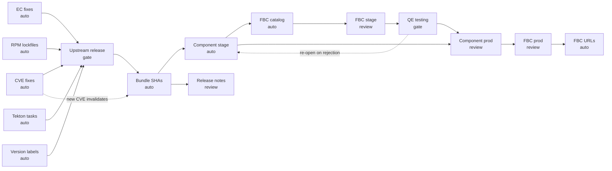

# Jira Release Tracker

Design plan for adding structured Jira-based release tracking to the Submariner release process.
*Version 1.0 — 2026-07-01*

**TL;DR:** A Jira parent task per release with 15-19 subtasks (one per release step). Automation
appends structured comments as steps complete, giving stakeholders real-time visibility without
cluster access. Handles the cyclical reality of releases (steps reopen, stages repeat) via
append-only comments where the latest comment is current state. ~1,300 LOC across 3 phases
after a 1-day proof of concept (PoC), delivering Slack thread replacement (PR tracking) within the first 2-3 weeks.

## Problem Statement

The Submariner release process is a 20-step workflow: fix CVEs and EC violations across 7
upstream repos, cut an upstream release, update bundle SHAs, create stage Release CRs in
Konflux, add release notes from Jira, build FBC catalogs for each OCP version, hand off to
QE for per-platform testing, then repeat for production. The full process is documented in
CLAUDE.md; this plan designs the tracking system that sits alongside it.

Today this process is coordinated by CLAUDE.md, shell scripts, and cluster state queries.
Release progress is only visible by:

- Reading git commits in this repo
- Querying the Konflux cluster (`oc get releases`)
- Running `/release-ls` (ephemeral, requires cluster access)
- Asking the person doing the release

This creates three problems:

1. **No visibility for stakeholders.** Management, QE, docs, and partner teams cannot see where a
   release stands without asking. There is no dashboard, no status page, no shared view.

2. **No persistent state for automation.** Each script independently re-derives state from the
   cluster and filesystem. There is no shared record of "CVE scan completed on June 15 with 0
   critical findings" that a later step can reference. When the release engineer switches contexts
   (or sessions), context is lost.

3. **No staleness detection.** If a CVE scan was done two weeks ago and new advisories have been
   published since, nothing flags that the scan should be re-run before cutting the release. The
   same applies to bundle SHAs (new component builds since update), EC compliance (new Tekton task
   versions), and other time-sensitive checks.

## Design Goals

1. **Single source of truth** for release progress, accessible to anyone with Jira access
2. **Machine-readable state** that automation can query and update
3. **Human-readable progress** that stakeholders can follow without understanding Konflux internals
4. **Staleness tracking** for time-sensitive steps (CVE scans, RPM lockfiles, SHA updates)
5. **Minimal friction** for the release engineer - automation updates Jira, not the human
6. **Incremental adoption** - can be added step-by-step without rewriting existing scripts
7. **Foundation for agentic automation** - the tracker's machine-readable state enables
   increasingly autonomous release workflows. An agent that can read "CVE fixes: done,
   EC fixes: done, RPM lockfiles: stale" can decide to re-run lockfile updates and proceed
   to the next step without human intervention. Current data model supports ~60% autonomous
   operation. Key gaps for full autonomy: snapshot readiness requires Konflux cluster queries
   (not cached in Jira), QE approval has no structured format, and some steps (EC log download)
   require human input. Each implementation phase closes more gaps.

## Key Design Insight: Releases Are Cyclical, Not Linear

The 20-step workflow in CLAUDE.md suggests a linear progression. Real releases are **cyclical**.
The 0.23 release thread illustrates a common pattern:

```text
fix CVEs → stage → QE finds MetricsProxy bug → fix bug → re-stage → new gRPC CVE published
→ fix CVE → bundle update → re-stage → QE tests again → QE approves → prod
→ post-release: P/Z arch issues found → investigate → wrong SHA, not a real bug
```

This means:

- **Steps go backward.** "CVE fixes: Done" becomes "CVE fixes: In Progress" when a new CVE appears.
- **QE doesn't just approve/reject.** They test per-platform (AWS, vSphere, ROSA, Azure, ARO, GCP)
  and report real bugs with pod logs and reproduce steps.
- **Late-breaking changes are normal.** New CVEs, team-discovered bugs, RHEL version decisions,
  and cross-team dependencies (FIPS, Comet registry) inject work mid-release.
- **Multiple stage cycles.** A release may be staged 2-3 times before QE approves.
- **Known issues are first-class.** The Azure machineset KI required its own Jira, docs PR, addon
  change, and script — tracked across teams and versions.
- **Post-release verification on all architectures** (amd64, arm64, ppc64le, s390x) can surface
  issues that weren't caught in pre-release testing.

The tracker must handle **subtask reopening** (Done → In Progress) and **multiple completion
comments** per subtask (attempt 1: "staged", attempt 2: "QE found bug", attempt 3: "fixed and
re-staged"). The append-only comment model handles this naturally — each stage cycle adds a new
comment, and the latest comment is the current state.

## Non-Goals

- Replacing the existing git-based release YAML workflow (Jira tracks progress, git stores artifacts)
- Building a Jira dashboard or custom UI (Jira's built-in views are sufficient)
- Automating the entire release process end-to-end (human judgment still required at key gates)
- Tracking upstream development work (ACM project already handles that)

---

## Glossary

| Term | Definition |
| ------ | ----------- |
| ACM | Advanced Cluster Management — the Red Hat product that ships Submariner |
| ADF | Atlassian Document Format — Jira's internal rich text format (markdown converts to ADF) |
| EC | Enterprise Contract — compliance validation that Konflux builds must pass |
| FBC | File-Based Catalog — declarative YAML format for OLM operator catalogs |
| JQL | Jira Query Language — used for label-based tracker lookups and cross-release queries |
| Konflux | Red Hat's CI/CD platform for building and releasing container images |
| OCP | OpenShift Container Platform — FBC catalogs are per-OCP-version |
| RHSA | Red Hat Security Advisory — release containing CVE fixes |
| RHBA | Red Hat Bug Fix Advisory — release containing bug fixes only |
| Snapshot | Konflux build artifact capturing all 9 component images at a point in time |
| Release CR | Kubernetes Custom Resource that triggers the Konflux release pipeline |

---

## Jira Issue Architecture

### Hierarchy

Each subtask represents a distinct activity with its own set of per-repo PRs or artifacts.
This matches how work is actually tracked (see "Real-World Tracking" below).

```text
Task: "Release Submariner 0.20.3"                    ← Parent (the release)
│
│ ─── Branch Setup (Y-stream only) ───
├── Subtask: "Create upstream release branches"       ← Step 1
├── Subtask: "Configure Konflux downstream"           ← Step 2
├── Subtask: "Tekton component setup"                 ← Step 3
├── Subtask: "Tekton bundle setup"                    ← Step 3b
│
│ ─── Build Readiness ───
├── Subtask: "CVE fixes"                              ← Step 5 (PRs per repo)
├── Subtask: "EC compliance fixes"                    ← Step 4 (PRs per repo)
├── Subtask: "RPM lockfile updates"                   ← Part of Step 5 (PRs per repo)
├── Subtask: "Tekton task updates"                    ← Part of Step 4 (PRs per repo)
├── Subtask: "Version label updates"                  ← Step 5b, Z-stream (PRs per repo)
├── Subtask: "Cut upstream release"                   ← Step 6
├── Subtask: "Update bundle SHAs"                     ← Step 7
│
│ ─── Stage Release ───
├── Subtask: "Component stage release"                ← Steps 8, 10
├── Subtask: "Release notes"                          ← Step 9
├── Subtask: "FBC catalog update"                     ← Step 11
├── Subtask: "FBC stage releases"                     ← Steps 12, 13
│
│ ─── QE Validation ───
├── Subtask: "QE testing"                             ← Steps 14, 19 (assigned to QE)
│
│ ─── Production Release ───
├── Subtask: "Component prod release"                 ← Steps 15, 16
├── Subtask: "FBC prod releases"                      ← Steps 17, 18
└── Subtask: "FBC prod URL conversion"                ← Step 20 (90-day deadline)
```

Phase labels (Branch Setup, Build Readiness, etc.) are visual groupings, not Jira objects.
Only subtasks are created as Jira issues.

**Subtask counts:**

| Release type | Setup | Core | Total |
| ------------- | ------- | ------ | ------- |
| Y-stream | 4 | 15 | 19 |
| Z-stream | 0 | 15 | 15 |

The 15 core subtasks are always created (including FBC prod URL conversion, which has a
90-day deadline). The 4 Setup subtasks are Y-stream only.

### Real-World Tracking: Why This Granularity

Today, release progress is tracked in Slack threads like this (from a real 0.20.3 release):

```text
dfarrell07 [11:19 PM]
CVE PRs:
https://github.com/submariner-io/submariner/pull/4068
https://github.com/submariner-io/submariner-operator/pull/4115
https://github.com/submariner-io/admiral/pull/1365
https://github.com/submariner-io/cloud-prepare/pull/1384
https://github.com/submariner-io/lighthouse/pull/2201
https://github.com/submariner-io/subctl/pull/1815

dfarrell07 [6:18 PM]
EC fix PRs:
https://github.com/submariner-io/submariner-operator/pull/4117
https://github.com/submariner-io/submariner/pull/4071
...

dfarrell07 [2:30 PM]
RPM lockfile updates:
https://github.com/submariner-io/shipyard/pull/2475
https://github.com/submariner-io/submariner/pull/4072
```

Each activity type produces one PR per affected repo. The release engineer needs to track
which PRs are open, merged, or need review — and who is blocking. Each activity gets its own
subtask with a PR list. The subtask structure is a consistent baseline; the release engineer
can merge related subtasks if a particular release calls for different grouping.

### Why Task + Subtasks (not Epic)

The ACM Jira project uses Epics for feature planning (linked to Features and Stories in the
product hierarchy). Creating release-tracking Epics would pollute planning views and conflict with
ACM's workflow. Tasks with subtasks are lightweight, don't appear in roadmap views, and can still
be filtered/queried via JQL.

### Issue Fields

**Parent Task:**

| Field | Value | Purpose |
| ------- | ------- | --------- |
| Project | ACM | Existing project |
| Type | Task | Lightweight, no planning impact |
| Summary | `Release Submariner 0.X.Y` | Human-readable title |
| Labels | `release-tracking`, `submariner`, `release-X-Y-Z` (e.g., `release-0-24-0`) | Filtering and queries |
| Component | *(omit — see Known Risks: notification/board)* | Avoids spam |
| Fix Version | `ACM 2.(X-7).0` | Links to ACM release |
| Assignee | Release engineer | Accountability |
| Description | Human-readable release summary (see below) | Context for stakeholders |

**Subtasks:**

| Field | Value |
| ------- | ------- |
| Type | Sub-task |
| Summary | Activity name (e.g., "CVE fixes", "FBC stage releases") |
| Labels | `release-tracking`, `release-X-Y-Z`, phase-specific label |
| Description | Phase checklist + acceptance criteria |

### Parent Task Description Template

The description contains both human-readable context and a machine-parseable metadata block:

```markdown
## Release Info

- **Version:** 0.24.0
- **Type:** Y-stream (new minor version)
- **ACM Version:** 2.17.0
- **Release Branch:** release-0.24
- **Release Engineer:** Daniel Farrell

## Key Artifacts

Updated by automation as the release progresses.

- **Snapshot:** _(pending)_
- **Stage Release:** _(pending)_
- **Prod Release:** _(pending)_
- **FBC Catalog URLs:** _(pending)_
- **Advisory:** _(pending)_

```

The description is pure human-readable markdown. Current state is derived from subtask statuses
and their latest comments — no embedded JSON in the description. This avoids synchronization
problems between description and comments, and keeps the description easy to edit by hand.

---

## Data Model

### Structured Comments

Each automation step writes a structured comment when it completes. Comments serve as an append-only
log of what happened and when, while the description holds the current-state summary.

Comment format (the human-readable part followed by a STEP_DATA code block):

````text
## [Step 5] CVE Scan Complete

- **Timestamp:** 2026-07-01T14:30:00Z
- **Duration:** 12 minutes
- **Result:** PASS (0 critical, 0 high, 3 medium, 1 low)
- **Snapshot scanned:** submariner-0-24-20260701-103000-000

---
```STEP_DATA
{"_t":"STEP_DATA","step":"cveScan","timestamp":"2026-07-01T14:30:00Z","status":"pass"}
```
````

The human-readable section above the code block lets anyone understand what happened.
The JSON inside a fenced code block (` ```STEP_DATA `) lets automation query results
programmatically while rendering cleanly in Jira as a formatted code snippet.

**Why code blocks, not square-bracket delimiters:** Jira's wiki markup renderer interprets
`[text]` as link syntax ([JRA-33392](https://jira.atlassian.com/browse/JRA-33392), confirmed
"expected behavior"). Using fenced code blocks avoids this and renders correctly across both
the wiki renderer and the ADF editor.

**Round-trip resilience:** Jira converts markdown to ADF for storage. The `STEP_DATA` language
tag on the code block may not survive the ADF-to-markdown re-serialization. As a fallback,
include a `"_t":"STEP_DATA"` sentinel key inside every JSON payload so `get_step()` can match
on the JSON content even if the fence language tag is lost. Phase 0 PoC step 3 validates this.

### Jira Rendering Limitations

Jira Cloud's markdown support is limited compared to GitHub-flavored markdown. The plan's
templates must account for these constraints:

**Supported (use freely):**

- `## Headings`, `**bold**`, `_italic_`, `~~strikethrough~~`
- `- bullet lists`, `1. numbered lists`
- Inline code, fenced code blocks
- `[link text](url)` hyperlinks
- `---` horizontal rules, `> blockquotes`

**NOT supported (avoid in Jira content):**

- **Pipe tables** (`| col | col |` with `|---|`) — Jira does not render these. Use bold-label
  bullet lists instead: `- **repo** — PR-URL — Status`
- **`- [ ]` checkboxes** — Jira uses `[]` syntax (no dash), unreliable via API. Use bullet
  lists with status labels instead.
- **Square bracket delimiters** — interpreted as links. Use code blocks.

**Template format for Jira:** The subtask description templates in this plan use markdown
tables for readability in this document. During implementation, convert tables to bold-label
bullet lists for Jira rendering:

```text
## Instead of:
| Repo | PR | Status |
| ------ | ---- | -------- |
| submariner | https://... | Merged |

## Use:
- **submariner** — https://github.com/submariner-io/submariner/pull/4068 — Merged
- **operator** — https://github.com/submariner-io/submariner-operator/pull/4115 — Needs review
```

### Subtask Registry

Each subtask maps to one or more CLAUDE.md steps and has a step key for automation.

#### Phase: Branch Setup (Y-stream only)

| Key | Subtask | Steps | Repos Involved |
| ----- | --------- | ------- | ---------------- |
| `createBranches` | Create upstream release branches | 1 | releases (triggers all) |
| `configureDownstream` | Configure Konflux downstream | 2 | konflux-release-data |
| `tektonComponents` | Tekton component setup | 3 | operator, submariner, lighthouse, subctl, shipyard |
| `tektonBundle` | Tekton bundle setup | 3b | operator |

#### Phase: Build Readiness (PR-tracked subtasks)

These subtasks each produce PRs across multiple repos. The subtask description lists repos and
PR URLs, updated as PRs are created and merged.

| Key | Subtask | Steps | Repos Involved |
| ----- | --------- | ------- | ---------------- |
| `cveFixes` | CVE fixes | 5 | operator, submariner, lighthouse, subctl, shipyard, admiral, cloud-prepare |
| `ecFixes` | EC compliance fixes | 4 | operator, submariner, lighthouse, subctl, shipyard |
| `rpmLockfiles` | RPM lockfile updates | 5 | submariner, shipyard |
| `tektonTasks` | Tekton task updates | 4 | operator, submariner, lighthouse, subctl, shipyard |
| `versionLabels` | Version label updates | 5b | operator, submariner, lighthouse, subctl, shipyard |
| `upstreamRelease` | Cut upstream release | 6 | releases |
| `bundleShas` | Update bundle SHAs | 7 | operator |

#### Phase: Stage Release

| Key | Subtask | Steps | Artifacts |
| ----- | --------- | ------- | ----------- |
| `componentStage` | Component stage release | 8, 10 | Release CR name, snapshot |
| `releaseNotes` | Release notes | 9 | RHSA/RHBA type, issue count |
| `fbcCatalogUpdate` | FBC catalog update | 11 | FBC repo PR |
| `fbcStageReleases` | FBC stage releases | 12, 13 | 7 Release CR names (per OCP) |

#### Phase: QE Validation

| Key | Subtask | Steps | Artifacts |
| ----- | --------- | ------- | ----------- |
| `qeValidation` | QE testing | 14, 19 | Stage catalog URLs, prod index URLs, approval |

#### Phase: Production Release

| Key | Subtask | Steps | Artifacts |
| ----- | --------- | ------- | ----------- |
| `componentProd` | Component prod release | 15, 16 | Release CR name |
| `fbcProdReleases` | FBC prod releases | 17, 18 | Release CR names per OCP |
| `fbcProdUrls` | FBC prod URL conversion | 20 | FBC repo PR (90-day deadline) |

### Key Artifacts Tracked

These are the critical pieces of data that flow between steps:

- **Snapshot name** — produced by Step 7, consumed by Steps 8, 12, 15, 17
- **Stage release name** — produced by Step 8, consumed by Steps 10, 15
- **Prod release name** — produced by Step 15, consumed by Step 16
- **FBC snapshot names** — produced by Step 11 (one per OCP), consumed by Steps 12, 17
- **Stage catalog URLs** — produced by Step 13 (one per OCP), consumed by Step 14 (QE)
- **Prod index URLs** — produced by Step 18 (one per OCP), consumed by Step 19 (QE)
- **CVE scan results** — produced by Step 5, consumed by Step 9 (notes) and freshness
- **Release notes type** — produced by Step 9 (RHSA/RHBA), consumed by Steps 10, 15
- **QE approval** — produced by Step 14 (approved/pending), gates Steps 15-18

---

## Freshness Model

Each time-sensitive step has a **staleness window** — a period after which the results may be
outdated and should be rechecked before proceeding.

### Staleness Rules

- **CVE fixes** — stale after 3 days (new Go/RPM security advisory)
- **RPM lockfiles** — stale after 3 days (new RPM package updates)
- **EC compliance** — stale on snapshot change (new Tekton task versions)
- **Bundle SHAs** — stale on snapshot change (new component builds)
- **FBC Catalog** — stale on new bundle build (new component stage release)
- **QE Approval** — stale on snapshot change (would need re-test)
- **QE Approval (RHSA)** — stale after 14 days (security SLA)
- **FBC prod URLs** — stale after 75 days (quay.io URLs expire at ~90 days)

**CVE recheck gate:** The bundle SHA update step should always recheck for new CVEs unless the
CVE fix step completed within the last 24 hours. This is the last chance to catch new
advisories before the release is cut. The staleness check is built into the bundle SHA script,
not left to the release engineer to remember.

**RPM lockfile recheck:** RPM lockfiles may need to be redone if new RPM updates have been
published since the lockfiles were generated. The staleness window is the same as CVE fixes
(3 days) because RPM updates often accompany CVE fixes.

### How It Works

1. **When a step completes**, automation writes a ` ```STEP_DATA ` comment with a `timestamp`.
   No validity metadata is stored per-step — staleness rules live in code.

2. **When `/release-ls` runs** (or a downstream step starts), it reads the `timestamp` from
   each step's latest comment and applies the staleness table (defined in the release tooling,
   not in Jira data):

```text
   # Staleness rules (in release-status.sh or jira-tracker.sh)
   STALENESS_RULES=(
     "cveFixes:3d"              # Recheck CVEs if >3 days old
     "rpmLockfiles:3d"          # Recheck RPM lockfiles if >3 days old
     "ecFixes:snapshot"         # Stale if snapshot changed since completion
     "bundleShas:snapshot"      # Stale if snapshot changed since completion
     "fbcCatalogUpdate:snapshot" # Stale if component stage snapshot changed
     "qeValidation:snapshot"    # Stale if snapshot changed (would need re-test)
     "fbcProdUrls:75d"          # quay.io URLs expire at ~90 days
   )
   # Snapshot-triggered staleness: update_step callers MUST include
   # {"snapshot": "name"} in the data param for snapshot-dependent steps.
   # check_freshness compares the stored snapshot against bundleShas step's
   # snapshot (the latest known snapshot in Jira), avoiding cluster queries.
   # For RHSA releases, qeValidation also stale after 14 days (security SLA).
   ```

   Additionally, the bundle SHA update script enforces a hard gate: if `cveFixes` is older
   than 24 hours, it warns and suggests re-running CVE checks first.

1. **The release-ls skill** checks all steps for freshness and highlights stale ones:

```text
   Submariner 0.24.0 Release Status
   ✓ EC compliance            Complete (2026-06-20)
   ⚠ CVE fixes                STALE - completed 2026-06-15, 16 days ago (limit: 3 days)
   ✓ Bundle SHAs              Complete (2026-06-28)
   → Component stage release  In Progress
   ○ QE validation            Pending
   ```

1. **Staleness does not block.** It warns. The release engineer decides whether to recheck or
   proceed. This avoids false gates while surfacing risk.

### Dependency Graph and Automation Levels

Visual overview of the release pipeline (Z-stream). Arrows show dependencies; labels show
automation level (auto/review/gate). The cyclical re-open path is shown as a dashed line.



For agentic automation (Design Goal #7), two additional data structures live in code alongside
the staleness rules:

```bash
# Step dependency graph — agent checks all deps are Done before starting a step
# Y-stream setup steps included; skipped automatically for Z-stream releases
DEPENDENCIES=(
  # Branch Setup (Y-stream only)
  "createBranches:"                                  # First step, no deps
  "configureDownstream:createBranches"               # Needs branches to exist
  "tektonComponents:configureDownstream"              # Needs Konflux configured
  "tektonBundle:configureDownstream"                  # Needs Konflux configured

  # Build Readiness (all release types)
  "cveFixes:"                                        # Can start immediately
  "ecFixes:"                                         # Can start immediately
  "rpmLockfiles:"                                    # Can start immediately
  "tektonTasks:"                                     # Can start immediately
  # Note: for Y-stream, tektonTasks depends on tektonComponents,tektonBundle
  "versionLabels:"                                   # Z-stream only, no deps
  "upstreamRelease:cveFixes,ecFixes,rpmLockfiles,tektonTasks"  # All PRs merged
  # Note: versionLabels added to upstreamRelease deps for Z-stream only

  # Snapshot & Release
  "bundleShas:upstreamRelease"                       # Needs upstream tags
  "componentStage:bundleShas"                        # Needs SHAs updated
  "releaseNotes:bundleShas"                          # Created from snapshot, not stage release
  "fbcCatalogUpdate:componentStage"                  # Needs stage applied (step 10)
  "fbcStageReleases:fbcCatalogUpdate"                # Needs catalogs rebuilt

  # QE Gate
  "qeValidation:fbcStageReleases"                    # All FBC stages must pass

  # Production Release
  "componentProd:qeValidation,componentStage"        # Needs QE + stage complete
  "fbcProdReleases:componentProd"                    # Needs prod component released
  "fbcProdUrls:fbcProdReleases"                      # Needs prod FBC released
)

# Automation level per step
#   auto   — agent can execute without human
#   review — agent executes, human reviews result before proceeding
#   gate   — human decision required, agent cannot proceed
AUTOMATION_LEVEL=(
  "createBranches:review"       # Agent prepares, human approves branch creation
  "configureDownstream:auto"    # Deterministic config generation
  "tektonComponents:auto"       # Deterministic pipeline setup
  "tektonBundle:auto"           # Deterministic pipeline setup
  "cveFixes:auto"
  "ecFixes:auto"
  "rpmLockfiles:auto"
  "tektonTasks:auto"
  "versionLabels:auto"
  "upstreamRelease:gate"        # Human decides "nothing else needs to go in"
  "bundleShas:auto"
  "componentStage:auto"         # Creates YAML, agent applies
  "releaseNotes:review"         # Agent generates, human reviews removals
  "fbcCatalogUpdate:auto"       # Deterministic catalog update
  "fbcStageReleases:review"     # Agent creates YAMLs, human applies (cluster retries)
  "qeValidation:gate"           # QE must approve, agent cannot proceed
  "componentProd:review"        # Agent creates YAML, human verifies before apply
  "fbcProdReleases:review"      # Agent creates YAMLs, human applies
  "fbcProdUrls:auto"            # Usually automatic during next release
)
```

An agent uses these to: (1) determine which steps are ready (all deps Done + not stale),
(2) decide whether it can execute autonomously or needs human input, and (3) sequence work
correctly across the release pipeline.

**Handling cyclical releases (step re-opening):** When a step moves from Done back to
In Progress (e.g., new CVE discovered after cveFixes was Done), transitive invalidation
flags all downstream Done steps as stale. This is **lazy** (checked at query time by
`check_freshness()` and `/release-ls`), not eager (no automatic Jira transitions on
dependents). The agent walks the dependency graph forward from the re-opened step and
checks if each descendant's subtask is still Done — if so, it's stale. A step is stale
if EITHER its staleness rule fires OR a transitive ancestor was re-opened.

`auto` steps must be **re-entrant**: able to detect prior completion and produce correctly
incremented artifacts (new attempt number, new snapshot). The `update_step()` function
supports Done → In Progress transitions for re-opened steps.

See Design Decisions section for why staleness rules, dependencies, and automation levels live
in code rather than in per-step Jira data.

---

## Automation Integration

### Architecture

```text
┌──────────────────────────────────────────────────────────────────┐
│                        Jira (ACM Project)                        │
│                                                                  │
│  Task: "Release Submariner 0.24.0"                               │
│  ├── Description: human-readable summary (no embedded JSON)      │
│  ├── Comments: step completion records (append-only log)         │
│  └── Subtasks: 15-19 per release, grouped into 5 phases          │
│                                                                  │
└──────────────┬───────────────────────────────┬───────────────────┘
               │ read/write                    │ read
               │                               │
┌──────────────┴───────────────┐  ┌─────────────┴──────────────────┐
│  scripts/lib/jira-tracker.sh  │  │  release-ls / stakeholders     │
│  (shared library)             │  │  (read-only consumers)         │
│                               │  └────────────────────────────────┘
│  Functions:                   │
│  - find_release_tracker()     │
│  - create_release_tracker()   │
│  - update_step()              │
│  - get_step()                 │
│  - check_freshness()          │
│  - update_subtask_description │
│  - get_release_summary()      │
│  - close_release_tracker()    │
└──────────────┬────────────────┘
               │ called by
               │
┌──────────────┴───────────────────────────────────────────────────┐
│  Existing scripts (minimally modified)                           │
│                                                                  │
│  create-component-release.sh  → update_step(componentStage)      │
│  create-fbc-releases.sh      → update_step(fbcStageReleases)     │
│  add-release-notes.sh        → update_step(releaseNotes)         │
│  verify-fbc-release.sh       → check_freshness(bundleShas)       │
│  release-status.sh           → reads all step data from Jira     │
│  ...etc                                                          │
└──────────────────────────────────────────────────────────────────┘
```

### Shared Library: `scripts/lib/jira-tracker.sh`

Core functions (high-level design):

```text
find_release_tracker(version)
    Find the Jira task for a given release version.
    Query: project=ACM AND labels=release-tracking AND labels=release-X-Y-Z
    Returns: issue key (e.g., ACM-54321) or empty if not found
    Note: Version label uses hyphens (release-0-24-0) because dots break JQL parsing.
    Note: acli returns a flat JSON array [{}], not {"issues": [{}]}. Use jq '.[0].key'.

create_release_tracker(version, type)
    Create parent task + subtasks for a new release (15 for Z-stream, 19 for Y-stream).
    Called once at release start (Step 1 for Y-stream, first step for Z-stream).
    Uses acli bulk creation (acli jira workitem create-bulk) for efficiency.
    Returns: parent issue key

update_step(version, stepKey, status, data)
    Add a structured comment on the parent task recording step completion/failure.
    Transitions the corresponding subtask (New → In Progress → Done, and
    Done → In Progress for re-opened steps when cycles occur).
    data is a JSON object with step-specific results (snapshot name, PR URLs, etc.).

get_step(version, stepKey)
    Query the latest STEP_DATA code block comment matching stepKey.
    Fetches parent issue with comments (responseContentFormat: "markdown"),
    parses the body string with a simple regex to extract the code block content.
    Returns: JSON object with timestamp, status, and step-specific data.
    Implementation note: Use markdown format for both writing and reading —
    code blocks round-trip cleanly (verified against live Jira instance).
    Parsing is a regex match on the markdown string, not ADF JSON tree walking.
    Use --body-file (not --body) when writing to avoid shell quoting issues.

check_freshness(version, stepKey)
    Read step timestamp from Jira, apply staleness rule from hardcoded table.
    Returns: fresh | stale (with age and limit for display)

update_subtask_description(version, stepKey, content)
    Update a subtask's description (e.g., add PR table, catalog URLs).
    Used for PR-tracked subtasks where the description is the live view.

get_release_summary(version)
    Read data from 3 sources: (1) subtask Jira statuses (New/In Progress/Done),
    (2) parent task comments (STEP_DATA with timestamps, artifacts, freshness),
    (3) subtask descriptions (PR tables, catalog URLs). Produce structured summary.
    Used by release-ls to render progress view.

close_release_tracker(version, reason)
    Transition parent task and all subtasks to Closed with resolution "Won't Do"
    (transition 61, fields: {"resolution": {"name": "Won't Do"}}). Records reason
    as a comment on the parent task. Skips subtasks already Closed.
    Used when a release is abandoned mid-flight.

# Internal helpers (not part of the public API):

find_subtask(parentKey, stepKey)
    Find a subtask of the parent by matching the summary string against a
    step-key-to-title mapping (e.g., "cveFixes" → "CVE fixes"). Uses JQL:
    parent=PARENT_KEY AND summary ~ "TITLE". Returns subtask issue key.

STEP_TITLES — constant mapping from step keys to subtask summaries:
    createBranches="Create upstream release branches",
    configureDownstream="Configure Konflux downstream",
    tektonComponents="Tekton component setup",
    tektonBundle="Tekton bundle setup",
    cveFixes="CVE fixes", ecFixes="EC compliance fixes",
    rpmLockfiles="RPM lockfile updates", tektonTasks="Tekton task updates",
    versionLabels="Version label updates", upstreamRelease="Cut upstream release",
    bundleShas="Update bundle SHAs", componentStage="Component stage release",
    releaseNotes="Release notes", fbcCatalogUpdate="FBC catalog update",
    fbcStageReleases="FBC stage releases", qeValidation="QE testing",
    componentProd="Component prod release", fbcProdReleases="FBC prod releases",
    fbcProdUrls="FBC prod URL conversion"
```

### Integration Points Per Step

Each existing script adds 2-4 lines at entry and exit:

**Entry pattern:**

```bash
TRACKER=$(find_release_tracker "$VERSION")
if [ -n "$TRACKER" ]; then
  update_step "$VERSION" "componentStage" "in_progress" '{}'
  FRESHNESS=$(check_freshness "$VERSION" "bundleShas")
  [ "$FRESHNESS" = "stale" ] && warn "Bundle SHAs may be stale - consider re-running Step 7"
fi
```

**Exit pattern (success):**

```bash
if [ -n "$TRACKER" ]; then
  update_step "$VERSION" "componentStage" "complete" \
    "{\"releaseName\": \"$RELEASE_NAME\", \"snapshot\": \"$SNAPSHOT\"}"
fi
```

**Exit pattern (failure):**

```bash
if [ -n "$TRACKER" ]; then
  update_step "$VERSION" "componentStage" "failed" \
    "{\"error\": \"$ERROR_MSG\"}"
fi
```

### Jira API Access

The shared library uses **`acli` CLI** as the primary interface. This is the same tool already
used by the release-notes workflow for JQL queries and issue operations. Using `acli` means:

- Scripts work standalone (no Claude Code dependency)
- Same auth model as existing Jira integration (`acli jira auth login --web`)
- Bulk operations supported (`acli jira workitem create-bulk`)
- Retry logic follows existing patterns from `scripts/release-notes/`

When running inside Claude Code, skills can additionally use MCP Atlassian tools for richer
structured access (e.g., `getJiraIssue` with field selection). But the core library is
shell-based and works without Claude Code.

**Verified against live Jira (ACM project):**

- Issue types: Task (id: 10014) and Sub-task (id: 10015) both available
- Transitions are global — can move to any status from any state:
  New (11), Backlog (111), In Progress (71), Review (41), Testing (121),
  Resolved (131), Closed (61)
- Label-based JQL works (`labels = release-tracking AND labels = release-0-24-0`)
- Code blocks in comments round-trip cleanly via markdown contentFormat
- Use `--body-file` / `--description-file` for multi-line content with special characters

---

## Workflow Integration Details

### Creating a Release Tracker

**When:** At the start of a release (Step 1 for Y-stream, first step for Z-stream)

**Trigger:** New skill `/create-release-tracker 0.20.3` or integrated into existing first-step skills

**What it creates:**

Parent Task:

```text
Summary: Release Submariner 0.20.3
Labels: release-tracking, submariner, release-0-20-3
Fix Version: ACM 2.13.0
```

Creates all 15 subtasks from the Subtask Registry (see Data Model section) plus 4 Setup
subtasks for Y-stream. Key behavioral notes:

- **Release notes** may cycle Done → In Progress when issues are added/removed post-creation
  (historical data shows this is common — CVE filtering fixes, issue removals after review)
- **QE testing** is assigned to the QE engineer, not the release engineer. Automation
  populates it with catalog URLs; QE comments findings and approval directly on this subtask
- **FBC prod URL conversion** converts temporary quay.io bundle URLs to permanent
registry.redhat.io URLs in the FBC template. It has a ~90-day hard deadline (quay.io URLs
expire) but is usually handled automatically: `make update-bundle` auto-converts released
bundle URLs during the *next* release's FBC catalog update. The subtask tracks whether
conversion is complete. If no next release happens within 90 days, manual conversion is
needed.

For Y-stream, add 4 Setup subtasks at the top (branches, downstream config, Tekton components,
Tekton bundle) for 19 total. For Z-stream, Setup is omitted (15 subtasks).

### Reading State: Enhanced release-ls

The `/release-ls` skill currently queries the Konflux cluster for live state. With the tracker,
it gains a persistent layer that shows PR-level detail:

```text
/release-ls 0.20.3

Submariner 0.20.3 Release Status (ACM-54321)
═══════════════════════════════════════════════

Build Readiness
  ✓ CVE fixes              6/6 PRs merged                      2026-07-01
  → EC compliance fixes    4/5 PRs merged, 1 needs review      2026-07-01
     ⊘ shipyard #2473      Needs review
  ✓ RPM lockfile updates   2/2 PRs merged                      2026-07-01
  ✓ Tekton task updates    2/2 PRs merged                      2026-07-01
  ✓ Version label updates  5/5 PRs merged                      2026-07-02
  ✓ Upstream release       releases #1447 merged               2026-07-03
  ⚠ Bundle SHAs            Done 2026-07-03                     STALE (8 days)

Stage Release
  ○ Component stage release    Pending
  ○ Release notes              Pending
  ○ FBC catalog update         Pending
  ○ FBC stage releases         Pending

QE Validation
  ○ QE testing                 Pending (assigned to QE)

Production Release
  ○ Component prod release     Pending
  ○ FBC prod releases          Pending
  ○ FBC prod URL conversion    Pending (90-day deadline)

Key Artifacts:
  Snapshot: submariner-0-20-20260703-142000-000
  Stage: (pending)  |  Prod: (pending)

⚠ Bundle SHAs may be stale (8 days). Consider re-running /bundle-image-update.
⚠ EC compliance: 1 PR still needs review (shipyard #2473).
```

The key improvement: instead of abstract phase statuses, you see **exactly which PRs are blocking
progress** and what needs attention. This is the same information that was in the Slack thread,
but persistent and queryable.

### PR-Tracked Subtask Lifecycle

The PR-tracked subtasks (CVE fixes, EC fixes, RPM lockfiles, Tekton tasks, version labels) follow
a consistent lifecycle that maps to how work actually happens:

```text
┌─────────────┐    Skill creates PRs    ┌──────────────┐
│   New       │ ──────────────────────→ │ In Progress  │
│  (pending)  │    Updates subtask      │  (PRs open)  │
└─────────────┘    with PR table        └──────┬───────┘
                                               │
                        ┌──────────────────────┤
                        │                      │
                        ▼                      ▼
               ┌────────────────┐    ┌─────────────────┐
               │  Blocked       │    │  All PRs merged  │
               │ (needs review) │    │                  │
               └────────┬───────┘    └────────┬────────┘
                        │                      │
                        │  Review received     │
                        └──────────┬───────────┘
                                   │
                                   ▼
                          ┌────────────────┐
                          │     Done       │
                          └────────────────┘
```

**Automation updates at each transition:**

1. **Skill runs** (e.g., `/shipyard:cve-fix` across repos):
   - Transitions subtask: New → In Progress
   - Updates description with PR table (repo, URL, status)
   - Adds structured comment with PR details

2. **PR status check** (manual or `/release-ls`):
   - Queries GitHub API for each PR's merge status
   - Updates the table in the subtask description
   - If any PR needs review → notes the blocker
   - If all PRs merged → transitions subtask to Done

3. **Decision points** recorded as comments:

   ```text
   Per team call: cloud-prepare PR comments addressed, ready for re-review.
   Nothing else needs to go into the branch for this activity.
   ```

Each existing skill that creates PRs adds Jira tracking at the end of its run — updating
the subtask description with PR URLs and transitioning to In Progress.

If a skill only handles some repos (e.g., cve-fix handles Go deps but not RPM lockfiles),
the subtask shows partial progress and the remaining repos are handled by other skill runs. Each
run appends to the PR table rather than replacing it.

### QE Gate

Step 14 is unique because it requires human approval from an external team. The tracker handles
this by:

1. **Automation creates** the QE Validation subtask with catalog URLs in the description
2. **Release engineer** shares the subtask link with QE (replaces the manual "create QE ticket")
3. **QE comments** on the subtask with approval or issues found
4. **Release engineer** transitions subtask to Done when approved
5. **Downstream steps** (15-18) check: `get_step("qeValidation")` before proceeding

This replaces the current ad-hoc QE ticket creation with a structured handoff point that's part
of the release record.

### Retry Tracking

When a release step fails and is retried (common for FBC releases - infra flakiness), the tracker
records each attempt:

```markdown
## [Step 13] FBC Stage Release - Attempt 1 (FAILED)

- **Timestamp:** 2026-07-01T16:00:00Z
- **Result:** FAIL (4-19 infra timeout, 6/7 succeeded)
- **Details:** submariner-fbc-4-19-stage-20260701-01 failed: ManagedPipelineProcessed timeout

## [Step 13] FBC Stage Release - Attempt 2 (PASS)

- **Timestamp:** 2026-07-01T18:30:00Z
- **Result:** PASS (7/7 OCP versions succeeded)
- **Details:** submariner-fbc-4-19-stage-20260701-02 succeeded on retry
```

This creates an audit trail of retries that was previously only visible in git log.

---

## Error Handling

All Jira tracker updates are **best-effort**. Scripts never fail due to tracker errors.

**Principle:** The tracker is an observer, not a participant. If Jira is down, scripts run
exactly as they do today. The tracker gets updated on the next successful call.

**Failure modes:**

- **Jira API unreachable:** Log warning, continue script. Tracker misses this update.
- **Partial update:** Next script run or `/release-ls` reconciles.
- **Rate limiting:** Retry once after 2s delay. If still limited, log and skip.
- **Concurrent updates:** Last write wins. Structured comments (append-only) avoid conflicts.
- **Tracker not found:** Script runs normally, prints reminder to create tracker.

**Why best-effort is correct:** The git-based release YAMLs remain the source of truth for
what was actually released. The tracker is a progress view, not a control plane. Missing a
tracker update is annoying but not dangerous. Adding a hard dependency on Jira availability
would make releases fragile.

**When Jira and reality diverge:** If Jira says Done but the cluster shows Failed (e.g., a
release was applied after the tracker update but the pipeline failed), update the Jira subtask
back to In Progress and add a comment explaining the failure. If git shows a step completed
but Jira has no record (tracker wasn't running), add a manual comment with the completion
timestamp from git log. The engineer resolves discrepancies; `/release-ls` shows both sources
when they disagree.

---

## External Blockers

Releases can be stalled by infrastructure issues outside the team's control. Real examples:

- **Quay outage** — FBC stage releases failing because the container registry is down
- **Konflux block-releases** — `block-releases: true` applied cluster-wide, disabling all releases
- **QE PTO** — Approval delayed because the QE engineer is unavailable

The tracker handles external blockers as **comments on the affected subtask** with a consistent
format:

```markdown
## BLOCKED: Quay outage

- **Since:** 2026-06-02T22:49:58Z
- **Impact:** FBC stage releases cannot complete
- **Source:** Konflux team applied block-releases: true
- **Resolution:** Waiting for Quay recovery

## UNBLOCKED

- **Resolved:** 2026-06-04T10:00:00Z
- **Duration:** ~35 hours
```

When a subtask has a BLOCKED comment without a matching UNBLOCKED, `/release-ls` shows it:

```text
FBC stage releases           BLOCKED — Quay outage (2 days)
```

This makes infrastructure delays visible to stakeholders without requiring them to read
Slack or ask the release engineer what's happening.

---

## Concurrent Releases

Multiple releases can be in progress simultaneously. Historical data shows this is common:

- 0.24.0 prod + FBC releases happening same day as 0.21.3 stage work
- Different Y-streams routinely overlap during ramp-up periods

**How it works:** Each release has its own tracker (found via version-specific label: `release-0-24-0`).
The `find_release_tracker(version)` function always includes the version in the JQL query, so
there is no cross-contamination between concurrent releases.

**`/release-ls` without a version** should list all active trackers:

```text
/release-ls

Active Submariner Releases
═══════════════════════════
→ 0.20.3  (ACM-54321)  Build Readiness    RHSA   Started 2026-06-28
→ 0.24.1  (ACM-54400)  Stage Release      RHBA   Started 2026-06-20
```

---

## Stage-to-Prod Timeline

Historical stage-to-prod gaps: RHSA 8-14 days (security fast-track), RHBA up to 41 days
(full QE cycle). The QE testing subtask shows elapsed time; for RHSA releases, the staleness
table flags QE approval as stale after 14 days.

---

## Cross-Release Queries

Once multiple releases use the tracker, JQL enables powerful queries:

```jql
-- All active releases
project = ACM AND labels = release-tracking AND status != Done

-- Releases waiting on QE
project = ACM AND labels = release-tracking
  AND issueFunction in subtasksOf("labels = release-tracking")
  AND summary ~ "QE" AND status = "In Progress"

-- All 0.22.x releases (patch history)
project = ACM AND labels = release-tracking
  AND labels in (release-0-22-0, release-0-22-1, release-0-22-2)

-- Find tracker for specific version
project = ACM AND labels = release-tracking AND labels = release-0-24-0
```

Note: Version labels use hyphens (`release-0-24-0`) because JQL cannot parse dots in label
values. This is a Jira limitation, not a design choice.

---

## Subtask Description Templates

**Note:** All templates below use markdown tables for readability in this document. During
implementation, convert to bold-label bullet lists per the Jira Rendering Limitations section.

### PR-Tracked Subtasks (CVE fixes, EC fixes, RPM lockfiles, Tekton tasks, Version labels)

These are the core tracking subtasks - each lists every repo that needs a PR and the PR's status.
This is the format that replaces the Slack thread.

Example: **"CVE fixes"** subtask for Submariner 0.20.3:

```markdown
## PRs

| Repo | PR | Status |
| ------ | ---- | -------- |
| submariner | https://github.com/submariner-io/submariner/pull/4068 | Merged |
| submariner-operator | https://github.com/submariner-io/submariner-operator/pull/4115 | Merged |
| admiral | https://github.com/submariner-io/admiral/pull/1365 | Merged |
| cloud-prepare | https://github.com/submariner-io/cloud-prepare/pull/1384 | Needs review |
| lighthouse | https://github.com/submariner-io/lighthouse/pull/2201 | Merged |
| subctl | https://github.com/submariner-io/subctl/pull/1815 | Merged |

## Blockers

- cloud-prepare PR needs review from @Tom Pantelis

## Notes

All Go dependency CVEs fixed. No RPM CVEs (handled in separate subtask).
```

For the PR automation lifecycle, see the PR-Tracked Subtask Lifecycle section above.

### Single-Artifact Subtasks (branches, bundle SHAs, upstream release)

Example: **"Update bundle SHAs"** subtask:

```markdown
## Status

- **Snapshot:** submariner-0-20-20260701-103000-000
- **PR:** https://github.com/submariner-io/submariner-operator/pull/4120
- **Verification:** All 9 component SHAs match snapshot

## Components Updated

| Component | SHA (first 12) |
| ----------- | --------------- |
| submariner-operator | a1b2c3d4e5f6 |
| submariner-gateway | b2c3d4e5f6a1 |
| submariner-globalnet | c3d4e5f6a1b2 |
| submariner-route-agent | d4e5f6a1b2c3 |
| lighthouse-agent | e5f6a1b2c3d4 |
| lighthouse-coredns | f6a1b2c3d4e5 |
| nettest | 1a2b3c4d5e6f |
| subctl | 2b3c4d5e6f1a |
| submariner-bundle | 3c4d5e6f1a2b |
```

### Component Release Subtask (stage/prod)

```markdown
## Release

| Release Name | Snapshot | Attempt | Status |
| --- | --- | --- | --- |
| submariner-0-22-1-stage-20260217-01 | submariner-0-22-20260219-171157-000 | 1 | Failed |
| submariner-0-22-1-stage-20260217-02 | submariner-0-22-20260219-171157-000 | 2 | Succeeded |

Snapshot remains constant across retries. Attempt number matches the -NN suffix in the
release name.

## Notes

Attempt 1: ManagedPipelineProcessed timeout (infra)
Attempt 2: Succeeded on retry
PipelineRun: (link to Konflux UI)
```

### Release Notes Subtask

```markdown
## Advisory

- **Type:** RHSA (37 CVE issues) / RHBA (bug fixes only)
- **Total issues:** 44 (37 CVE + 7 non-CVE)
- **Unique CVEs:** 13
- **Review PR:** https://github.com/stolostron/submariner-release-management/pull/47

## Review Summary

- **Automation collected:** 44 issues from Jira (ACM project)
- **Per-issue agent review:** 7 non-CVE issues reviewed, 0 removed
- **CVE verification:** All 13 CVEs confirmed fixed via Clair scan
- **Excluded:** 0 issues removed after review

## Notes

Release notes may be updated post-creation (issues added/removed). Each update
is a separate git commit. This subtask cycles Done → In Progress when edits occur.
```

### FBC Release Subtasks (stage/prod)

Example: **"FBC stage releases"** subtask:

```markdown
## Releases

| OCP | Release Name | Snapshot | Attempt | Status |
| ----- | ------------- | ---------- | --------- | -------- |
| 4.16 | submariner-fbc-4-16-stage-20260701-01 | submariner-fbc-4-16-20260701-... | 1 | Succeeded |
| 4.17 | submariner-fbc-4-17-stage-20260701-01 | submariner-fbc-4-17-20260701-... | 1 | Succeeded |
| ... | ... | ... | ... | ... |
| 4.19 | submariner-fbc-4-19-stage-20260701-02 | submariner-fbc-4-19-20260701-... | 2 | Succeeded |
| ... | ... | ... | ... | ... |
| 4.22 | submariner-fbc-4-22-stage-20260701-01 | submariner-fbc-4-22-20260701-... | 1 | Succeeded |

One row per active OCP version. Each OCP version has its own snapshot (they are NOT shared).
Retries are per-OCP-version — 4-19 can be on attempt 2 while 4-16 is on attempt 1.

## Notes

4-19 failed on first attempt (infra timeout), succeeded on retry -02.
PipelineRun: `release-xyz-abc123` (link to Konflux UI for debugging).
```

### QE Testing Subtask

This subtask is **assigned to the QE engineer**, not the release engineer. Automation
populates it with catalog URLs; QE comments their findings and approval.

```markdown
## Stage Catalog URLs

| OCP | Catalog URL |
| ----- | ------------ |
| 4.16 | `quay.io/redhat-user-workloads/submariner-tenant/submariner-fbc-4-16@sha256:abc123...` |
| 4.17 | `quay.io/redhat-user-workloads/submariner-tenant/submariner-fbc-4-17@sha256:def456...` |
| ... | One row per active OCP version |

## Platform Testing Status

| Platform | Status | Notes |
| ---------- | -------- | ------- |
| AWS | _(pending)_ |  |
| vSphere | _(pending)_ |  |
| ROSA | _(pending)_ |  |
| Azure | _(pending)_ |  |
| ARO | _(pending)_ |  |
| GCP | _(pending)_ |  |
| IBM Power (ppc64le) | _(pending)_ |  |
| IBM Z (s390x) | _(pending)_ |  |

## Approval

- **Catalog URLs received:** (pending)
- **Platform testing complete:** (pending)
- **Known issues documented:** (pending)
- **QE approval:** (pending)
- **Polarion report linked:** (pending)

Assign this subtask to the QE engineer responsible for testing. The catalog URLs above
are populated by automation when stage releases complete — QE can start testing immediately.

**Important:** For pre-release testing, QE must configure ImageDigestMirrorSet (IDMS) and
ImageContentSourcePolicy (ICSP) BEFORE creating the CatalogSource and Subscription. The
IDMS/ICSP maps registry.redhat.io URLs to quay.io workspace URLs. If created after
installation, the OLM bundle unpack job will fail with DeadlineExceeded and must be
recreated. See the FBC installation docs for the correct mirror configuration.

**Note:** This subtask may cycle Done → In Progress if QE finds bugs that require fixes
and re-staging. Each test cycle gets a new comment with results.

## QE Findings

QE comments directly on this subtask with testing progress, bug reports (with pod logs and
reproduce steps), and platform-specific results. Link Polarion test reports when available.

## Go/No-Go Decision

When QE approves, use this structured format for the permanent record:

- **Decision:** GO / NO-GO
- **Approved by:** (QE engineer name)
- **Date:** YYYY-MM-DD
- **Known issues:** (list any issues accepted for release, e.g., "Azure workaround on OCP 4.20")
- **Conditions:** (e.g., "unconditional" or "requires known-issue doc update before advisory")
- **OCP versions tested:** (which versions were actually tested)

This go/no-go record creates an audit trail for why the release was approved, which is
especially important for RHSA releases where security timing matters.

## Known Issues

Known issues (KIs) that ship with the release are tracked here with links:

| KI | Jira | Docs PR | Workaround |
| ---- | ------ | --------- | ----------- |
| Azure machineset on OCP 4.21 | ACM-32615 | (link) | fix-gw-machineset.sh |

KIs involve cross-team coordination (docs team, addon team) and may have their own
Jira issues, docs PRs, and workaround scripts. Track them here so the go/no-go decision
has full context about what's shipping with known gaps.
```

### Cut Upstream Release Subtask

The upstream release is a multi-stage process in the `submariner-io/releases` repo. It tags
8 repos in dependency order (shipyard → admiral → projects → operator/subctl) and takes 2-5
days. The subtask tracks the PR and the decision to start:

```markdown
## Release

- **PR:** https://github.com/submariner-io/releases/pull/1447
- **Version:** v0.20.3
- **Branch:** release-0.20
- **Status:** Released (all 8 repos tagged)

## Decision

Per team call: nothing else needs to go into the branch - starting release.

## Upstream Images

Tags created at quay.io/submariner/*:v0.20.3 for:
gateway, route-agent, globalnet, operator, lighthouse-agent, lighthouse-coredns, nettest, subctl
```

This captures both the artifacts (version, branch, image tags) that downstream steps need and
the decision-point notes that currently live in Slack.

---

## Implementation Roadmap

### Phase 0: Proof of Concept (1 day)

Validate all core assumptions before writing library code:

1. Create one Task + one Sub-task in ACM with release-tracking labels
2. Add a comment with ` ```STEP_DATA ` code block
3. Read the comment back and verify the code block round-trips cleanly
4. Transition the subtask to In Progress (transition ID 71)
5. Clean up test issues

**Gate:** If any step fails, adjust the design before proceeding. If all pass, Phase 1 is safe.

**PoC executed 2026-07-01 — ALL PASS:**

- Task ACM-36915 + Sub-task ACM-36916 created with labels
- ` ```STEP_DATA ` code block with `"_t":"STEP_DATA"` sentinel round-tripped perfectly
- Transition ID 71 (In Progress) works for Sub-tasks
- Label-based JQL (`labels = release-tracking AND labels = release-0-poc-0`) finds both issues
- **Finding:** `components` field requires project-level permission; decision: omit component
  entirely to avoid notification spam and board pollution (see Known Risks)
- Done → In Progress re-open transition works (cyclical release model confirmed)
- Subtask lookup by `parent = KEY` JQL works
- Description update with bold-label PR list renders correctly in Jira

### Phase 1: Tracker Creation + PR Tracking (highest value first)

Deliver Slack thread replacement value in the first 2 weeks, not after 5 weeks.

1. Write `scripts/lib/jira-tracker.sh` with core functions
   - Source `scripts/lib/release-notes-common.sh` to reuse `query_jira()` and `view_jira()`
   - Follow the same patterns: `</dev/null` on all acli calls, 2-attempt retry with 2s sleep,
     jq null-safety operators, prerequisite validation at entry
   - This will be the first code that *writes* to Jira (existing code is read-only)
2. Create `/create-release-tracker` skill (creates parent + all subtasks)
3. Add PR recording to existing skills (CVE fix, EC fix, RPM lockfile, version labels)
4. Add `find_release_tracker()` to `release-status.sh` so `/release-ls` reads from Jira
5. Test with the next real release

**Deliverables:** Tracker creation, PR tracking that replaces Slack threads, Jira-aware release-ls.

### Phase 2: Pipeline and Artifact Tracking

Add Jira updates to release pipeline scripts.

1. Add release name recording to `/create-component-release`
2. Add per-OCP status recording to `/create-fbc-release`
3. Add catalog URL recording to `/get-fbc-urls`
4. Add freshness data to `/bundle-image-update` and CVE scan scripts
5. Enhance `/release-ls` to show freshness warnings

**Deliverables:** Full release lifecycle tracking, staleness detection.

### Phase 3: QE Integration and Polish

Replace ad-hoc QE ticket with structured subtask, add decision-point recording.

1. Have `/get-fbc-urls` populate QE subtask with catalog URLs
2. Document QE workflow (comment for approval on the subtask)
3. Add "decision comment" support for recording team decisions
4. Have prod release scripts check QE approval status

**Deliverables:** Structured QE handoff, decision audit trail.

### Effort Estimates

- **Phase 0 (PoC):** 0 LOC, 2-4h, 1 day
- **Phase 1 (Tracker + PR Tracking):** ~1,000 LOC, 80-120h, 2-3 weeks
- **Phase 2 (Pipeline/FBC):** ~120 LOC, 20-30h, 1 week
- **Phase 3 (QE/Polish):** ~170 LOC, 30-45h, 1 week
- **Total:** ~1,300 LOC, 130-200h, 4-5 weeks

Phase 0 validates assumptions before investing in code. Phase 1 merges the old Phases 1+2
to deliver the highest-value feature (Slack thread replacement via PR tracking) within the
first 2-3 weeks instead of after 3-4. Phases 2 and 3 add depth incrementally.

### Phase 1 Implementation Notes

Answers to implementation questions discovered during design review:

- **Version validation:** Require 3-segment version (X.Y.Z). Reject "0.24" (2 segments)
  because the label `release-0-24` would collide across all 0.24.x releases.
- **Avoid JQL index lag:** `create_release_tracker()` should return the parent key directly
  from the create call and pass it to subtask creation — not re-query via JQL. Jira's search
  index can lag seconds behind writes. Cache keys from creates, don't re-find them.
- **Caching parent key:** `update_step()` makes 2 JQL queries internally (find parent +
  find subtask). Scripts already call `find_release_tracker()` at entry. Consider having
  `update_step()` accept an optional cached parent key to avoid redundant lookups.
- **Resolution field required on Done transitions:** Transitions 131 (Resolved) and 61
  (Closed) have transition screens requiring a `resolution` field. Pass
  `fields: {"resolution": {"name": "Done"}}` when transitioning to these statuses.
  Transitions 71 (In Progress), 11 (New), etc. have no screen — no extra fields needed.
  Verified via live Jira PoC.
- **Subtask creation:** Use two-pass (create parent first, then subtasks with `--parent`),
  not `create-bulk`. Bulk JSON schema for `parentIssueId` is undocumented.
- **Component field:** Omit on all tracker issues to avoid notification spam and board
  pollution (see Known Risks). If needed later for reporting, set via separate edit call
  (creation requires project-level permission per PoC finding).
- **Fix Version:** Always `ACM 2.(X-7).0` regardless of Z-stream (0.24.1 → ACM 2.17.0).
  Verify the version string exists in Jira before setting.
- **Subtask-to-step mapping:** Subtasks are found by parent key + summary string match
  (e.g., summary = "CVE fixes" maps to step key `cveFixes`). Store the mapping as a
  constant in `jira-tracker.sh`.
- **QE assignee:** Parameter to `create_release_tracker()`. Defaults to unassigned if not
  provided; release engineer assigns manually later.
- **Idempotency:** `create_release_tracker()` calls `find_release_tracker()` first. If a
  tracker already exists, prints a warning and returns the existing key.
- **Comment reading format:** Use `responseContentFormat: "markdown"` — code blocks
  round-trip cleanly as plain strings (verified against live Jira instance).
  Parsing is a regex match on the markdown string, not ADF JSON tree walking.
- **Comment pagination:** `acli` with `--paginate` handles this. A release with 3 stage
  cycles might have ~20-30 comments; well within acli's pagination capability.
- **Jira vs cluster disagreement:** Jira is the persistent record; cluster is real-time.
  If Jira says Done but cluster says Failed, show both with a note. The engineer decides.

---

## Design Decisions

### Why structured comments, not custom fields?

Custom fields in shared Jira instances (ACM) require admin approval and affect all project users.
Structured comments in a known format achieve the same machine-readability without any Jira
configuration changes. The tradeoff is that querying comments via JQL is limited (text search only,
no structured queries), but the primary query path is by issue key (which is fast and exact).

### Why code blocks for structured data?

Early versions used HTML comments (`<!-- STEP_DATA -->`), then square-bracket delimiters
(`[STEP_DATA]`). HTML comments aren't reliably hidden by Jira. Square brackets are interpreted
as link syntax by Jira's wiki renderer (JRA-33392). The final design uses fenced code blocks
(` ```STEP_DATA `) which render correctly as formatted code in both Jira's wiki renderer and
ADF editor, while being easily parseable by automation.

### Why update the description, not just comments?

The description serves as the "current state" view - what are the key artifacts, what phase are
we in. Comments are the "history" view - what happened and when. Both are needed. Updating the
description means anyone opening the issue sees the current state immediately without scrolling
through comments.

### Why not a separate Jira project?

A separate project (e.g., SUBREL) would give full control over issue types, workflows, and fields.
But it would also be invisible to ACM stakeholders who already watch the ACM project. Using ACM
with labels keeps release tracking in the same view as the bugs and features being released.

### Why not use Jira webhooks for event-driven updates?

Webhooks would require infrastructure (a receiving service) and add complexity. The current design
is pull-based: scripts update Jira at completion. This is simpler, requires no infrastructure, and
is robust to network issues (retry logic in the library). Webhooks could be added later if
real-time dashboards are needed.

### Why staleness rules in code, not per-step data?

Early versions of this plan stored `validUntil` timestamps and `validWhile` conditions in each
step's JSON comment. This was dropped because: (a) staleness rules are release-process knowledge
that belongs in version-controlled code, not scattered across Jira comments; (b) `validWhile`
conditions like "no new advisories" can't be evaluated by automation anyway; (c) a hardcoded
staleness table in `release-status.sh` is simpler to maintain, test, and review. The step comment
only records *when* something happened; whether it's still valid is a policy question answered by
the release tooling.

---

## Known Risks and Mitigations

**QE approval lacks structured format** (Medium likelihood, Medium impact)
: QE uses Jira but approval is free-form comment. No standard go/no-go record.
  Mitigation: Use structured go/no-go template. Record who approved, known issues, conditions.

**Orphaned trackers** (Medium, Medium)
: Release abandoned mid-flight; tracker sits as In Progress forever.
  Mitigation: `close_release_tracker(version, reason)` transitions all subtasks to Won't Do.
  `/release-ls` flags trackers with no activity for 30+ days.

**STEP_DATA code block parsing** (Medium, Medium)
: Manual comment edits could corrupt JSON inside fenced code block.
  Mitigation: `get_step()` validates JSON with `jq -e . 2>/dev/null` and skips malformed blocks.

**PR description concurrent writes** (Low, Medium)
: Two skills update same subtask description; last write wins, first write's PRs lost.
  Mitigation: Each skill writes a comment (append-only, safe). Reconciliation builds the
  canonical description from comments.

**FBC prod URL conversion forgotten** (Medium, Low)
: 90-day deadline, no automated reminder, quay.io URLs expire silently.
  Mitigation: Added to staleness table (75-day rule). Set Jira due date at creation time.

**Step re-opened after downstream completion** (Medium, High)
: A predecessor re-opens after downstream steps already completed. Released artifacts may
  be based on stale inputs.
  Mitigation: Transitive invalidation flags all dependent Done steps as stale. Applied
  releases cannot be un-applied; mitigation is visibility + decision to re-release.

**Notification spam and board pollution** (High, Low)
: Creating 15-19 subtasks sends notifications and populates sprint boards. Mitigation:
  **omit the component field** on all tracker issues (parent + subtasks). The `release-tracking`
  label is sufficient for JQL queries; the component field adds no value but triggers
  notifications to component watchers and pollutes component-filtered boards. If component
  is needed later for reporting, add it via a separate edit after initial creation.

---

## Open Questions

1. **Submariner-addon**: Addon is excluded from the 9-component release and tracked separately
   in ACM with its own version branches (release-2.X). Should the tracker note this explicitly
   or is it out of scope?

### Resolved Questions

Decided during design review and PoC validation:

- **Permissions?** → Verified via PoC (2026-07-01). Task and Sub-task creation works.
  Component field omitted by design (avoids notification spam). Labels, transitions,
  comments with code blocks all work.

- **Z-stream: new tracker or reuse Y-stream?** → New tracker per Z-stream. Each release has
  its own lifecycle, snapshot, and notes.
- **Link tracker to fixed issues?** → Yes, via Jira issue links (type: Relates) for
  bidirectional visibility.
- **Store Jira key in release YAML?** → Yes, as an annotation or comment for bidirectional link.
- **Forgotten tracker?** → Scripts work without a tracker (best-effort), print a reminder.
  `/release-ls` offers to create one if missing.
- **Migration?** → Start fresh with the next release. No retroactive population.
- **Dry-run mode?** → Yes, `--dry-run` flag that logs without making API calls.
- **Failed/retried steps: overwrite or append?** → Append. Latest comment is current status.
- **Multi-version FBC tracking?** → Single subtask with per-OCP-version list.

---

## Success Metrics (check at 3 months)

1. **Tracker adoption:** 100% of releases have a tracker (JQL: `labels = release-tracking`)
2. **Slack reduction:** 50%+ fewer PR-tracking messages in release Slack threads
3. **Staleness catches:** At least 2 cases where `/release-ls` flagged a stale step before
   the engineer would have proceeded (proves the freshness model adds value)
4. **Stakeholder self-service:** 50%+ fewer "where are we on the release?" Slack questions
5. **Retry completeness:** 100% of retried releases have both attempts recorded in Jira

---

## Release Completion

When the last subtask completes (typically FBC prod releases or FBC prod URL conversion),
the parent task is transitioned to Done with a final summary comment:

```text
## Release Complete: Submariner 0.22.1

- **Stage released:** 2026-03-22
- **Prod released:** 2026-04-14
- **Advisory type:** RHSA (25 CVEs, 12 non-CVE fixes)
- **OCP versions:** 4.16, 4.17, 4.18, 4.19, 4.20, 4.21, 4.22
- **Prod index:** registry.redhat.io/redhat/redhat-operator-index:v4.21
- **Known issues:** Azure machineset on OCP 4.21 (ACM-30495, workaround script)
- **Stage cycles:** 3 (multi-arch FBC rebuild, gRPC CVE fix, cloud-prepare fixes)
```

This final summary replaces the Slack announcement ("SubM 0.22.1 is released") as the
permanent release record.

---

## Next Steps

1. ~~**Run Phase 0 PoC**~~ — **DONE** (2026-07-01, all 5 steps passed, see Phase 0 section)
2. **Start Phase 1** — implement `jira-tracker.sh` library and `/create-release-tracker` skill
3. **Use on the next release** — create a tracker for the next Z-stream, let existing skills
   populate PR tracking subtasks, validate the Slack thread replacement works in practice
